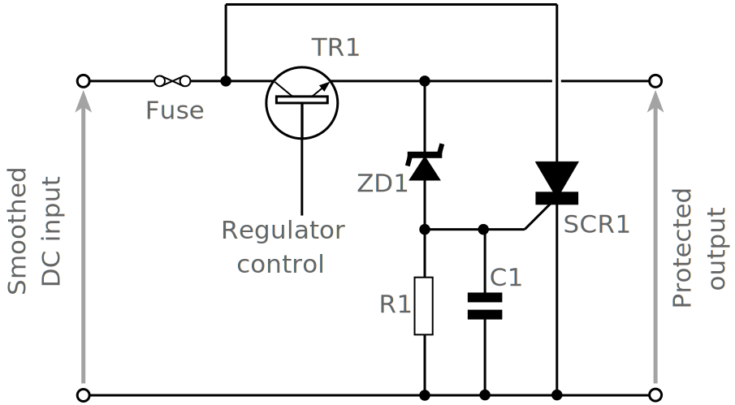

# SCR Thyristor Crowbar: overvoltage protection circuit

Retrieved from: https://www.electronics-notes.com/articles/analogue_circuits/thyristor-scr-triac/overvoltage-protection-crowbar-circuit.php

The thyristor or SCR can deliver an easy means of providing over-voltage
protection for power supplies using a crowbar circuit.

Power supplies are normally reliable, but if they fail then they can cause
significant damage to the circuitry they supply.

The thyristor or SCR can offer a very easy but effective method of providing
a crowbar circuit to protect against this eventuality.

## Analogue power supply failure modes

One failure mode is for many analogue regulated supplies is that the series
pass transistor can fail with a short circuit appearing between the
collector and emitter.
If this happens the full unregulated voltage can appear at the output, and
this would place an intolerably high voltage on the whole system causing
many ICs and other components to fail.

By looking at the voltages involved it is very easy to see why the
inclusion of overvoltage protection is so important.
A typical supply may provide 5 volts stabilised to logic circuitry.
To provide sufficient input voltage to give adequate stabilisation,
ripple rejection and the like, the input to the power supply
regulator may be in the region of 10 to 15 volts.
Even 10 volts would be sufficient to destroy many chips used today,
particularly the more expensive and complicated ones.
Accordingly preventing this is of great importance.

## Thyristor / SCR overvoltage crowbar circuit

The thyristor crowbar circuit shown is very simple, only using a few
components.
It can be used within many power supplies, and could even be retro-fitted
in situations where no over-voltage protection may be incorporated.

It uses just four components: a silicon controlled rectifier or SCR, a
zener diode, a resistor and a capacitor.

The SCR over voltage crowbar or protection circuit is connected between
the output of the power supply and ground.
The Zener diode voltage is chosen to be slightly above that of the output
rail.
Typically a 5 volt rail may run with a 6.2 volt Zener diode.
When the Zener diode voltage is reached, current will flow through the
Zener and trigger the silicon controlled rectifier or thyristor.
This will then provide a short circuit to ground, thereby protecting the
circuitry that is being supplied form any damage and also blowing the
fuse that will then remove the voltage from the series regulator.

As a silicon controlled rectifier, SCR, or thyristor is able to carry a
relatively high current - even quite average devices can conduct five
amps and short current peaks of may be 50 and more amps, cheap devices
can provide a very good level of protection for small cost.
Also voltage across the SCR will be low, typically only a volt when it
has fired and as a result the heat sinking is not a problem.

The small resistor, often around 100 ohms from the gate of the thyristor
or SCR to ground is required so that the Zener can supply a reasonable
current when it turns on.
It also clamps the gate voltage at ground potential until the Zener
turns on.
The capacitor C1 is present to ensure that short spikes to not trigger
the circuit.
Some optimisation may be required in choosing the correct value
although 0.1 microfarads is a good starting point.

If the power supply is to be used with radio transmitters, the filtering
on the input to the gate may need to be a little more sophisticated,
otherwise RF from the transmitter may get onto the gate and cause false
triggering.
The capacitor C1 will need to be present, but a small amount of
inductance may also help.
A ferrite bead may even be sufficient.
Experimentation to ensure that the time delay for the thyristor to
trigger is not too long against removing the RF.
Filtering on the power line to / from the transmitter can also help.

## Crowbar circuit limitations

Although this power supply overvoltage protection circuit is widely
used, it does have some limitations.

### Crowbar firing voltage

The firing voltage of the tthyristor crowbar circuit is set by the
Zener diode.
It is necessary to chose a Zener diode with the right voltage.
Zener diodes are not adjustable, and they come with at best a
5% tolerance.
The firing voltage must be sufficiently far above the nominal power
supply output voltage to ensure that any spikes that may appear
on the line do not fire the circuit.

### Susceptibility to RF

If the power supply is to be used to power a transmitter filtering
on the line to / from the transmitter is required along with some
careful design of the spike protection on the gate.

### Circuit threshold

When taking into account all the tolerances and margins the
guaranteed voltage at which the circuit may fire can be 20 - 40%
above the nominal dependent upon the voltage of the power supply.
The lower the voltage the greater the margins needed.
Often on a 5 volt supply there can be difficulty designing it so
that the overvoltage crowbar fires below 7 volts where damage may
be caused to circuits being protected.

## Conclusion

This simple thyristor crowbar circuit can be very effective.
It is simple even if a little crude, but can protect an expensive item
of equipment from the possible failure of the series regulator element.
